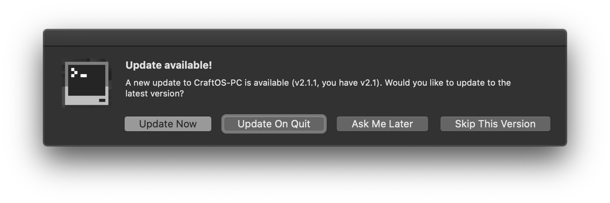

# Auto-Updater
CraftOS-PC includes an automatic updater that runs on start. 

## Supported operating systems
* Windows
* macOS

------

When a new update is available, a window will appear looking something like this:

* Clicking "Update Now" will download and install the update immediately.
* Clicking "Ask Me Later" will not update now, but it will prompt you on the next launch.
* Clicking "More Options..." will show an additional window with the following choices:
  * Clicking "Update On Quit" will queue the update to install once you quit CraftOS-PC.
  * Clicking "Skip This Version" will tell CraftOS-PC to skip updates for this version.
  * Clicking "View Release Notes" will open a window with the changelog for the new version.

## Update procedure
Once the update begins, a progress window will appear showing the download status. This window looks different on Windows and macOS, but both have a progress bar and text showing the total size, amount downloaded, and download speed. Once the download completes, the new files will be installed. On Windows, this involves running the installer in the background. On macOS, the application is copied from the disk image. After installation completes, CraftOS-PC relaunches automatically.

## On unsupported systems
On systems that do not support automatic updates (e.g. Linux), the auto-updater dialog will still appear but it will not have any option to update. Instead, it will direct you to download the new version manually from GitHub. You can still view the release notes even if automatic updating is not available.