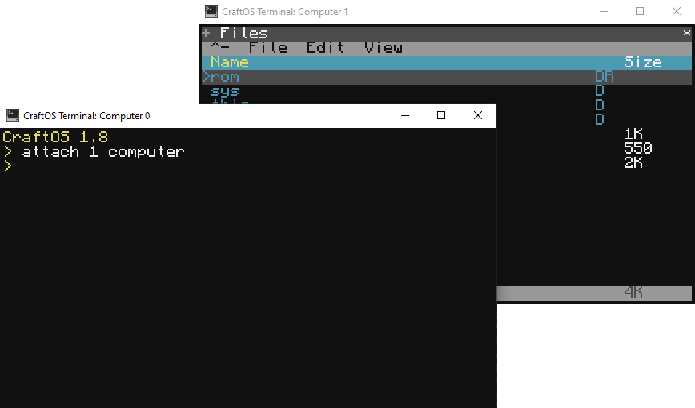

# Multiple Computers
CraftOS-PC 2 adds support for using multiple computers. Each computer gets its own filesystem, peripheral set, and terminal.

## Creating computers
Computers can be created [just like any peripheral](periphemu), but the ID selected must be a number. This number will be the ID of the new computer. For example, running "attach 1 computer" will create a computer with ID 1.

Creating a new computer will also attach a computer peripheral, which can be used to interact with the new computer from Lua. Note that detaching this computer will not turn the computer off - instead, use the `turnOff` method on the computer peripheral.

## About computer IDs
A computer's ID specifies which filesystem and configuration the computer uses. The files for each ID are stored at `computer/<id>` inside the CraftOS-PC save directory. These files are persistent for each computer using that ID, and creating a computer with a certain ID will always use the corresponding filesystem path. The computer-specific configuration will also always be assigned to a computer with that ID. This includes the computer's label and whether it's an Advanced Computer.