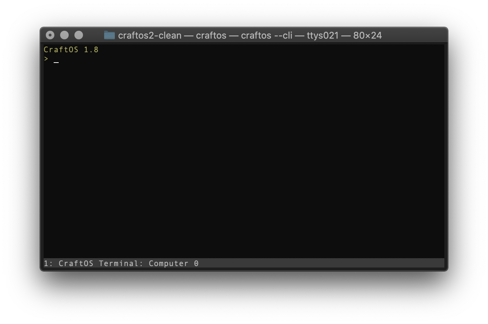

# Rendering Options
CraftOS-PC features a number of different rendering methods that you can choose from. These can be enabled with certain command line flags.

## GUI mode (none, `--gui`, `-r sdl`) [v2.0]
GUI mode is the default renderer for CraftOS-PC. It uses software rendering (on the CPU) to draw the screen. No arguments are required to use this mode, but if you want to manually specify it (for example, if `useHardwareRenderer` is enabled), you can use `--gui` to select it.

## Headless mode (`--headless`, `-r headless`) [v2.0]
CraftOS-PC has a lesser-featured headless mode that can display simple text output. It's designed to be able to run scripts in a CraftOS environment without the overhead of an interface. One use is for CI testing: when CI runs, it starts CraftOS-PC in headless mode using the `--script` argument (see below) to run a test suite. When in headless mode, you can pass a return code to `os.shutdown` to cause CraftOS-PC to exit with the code specified. CraftOS-PC will start in headless mode when the `--headless` argument is passed on the command line.

## CLI mode (`-c`, `-r ncurses`) [v2.1; v2.5 for Windows]
The command-line interface to CraftOS-PC can be activated by passing the `-c` or `--cli` option to the program. When in CLI mode, the CraftOS shell appears in the terminal instead of as a new window/application. This is what CLI mode looks like on a Mac:

In CLI mode, only one window (computer or monitor) can be viewed at a time. Windows can be cycled using Shift+Left/Right Arrow.

Please note that a few features are missing in CLI mode. First, modifier keys (such as Ctrl) are not detected in CLI mode; instead, pressing Home and End (fn+Left and fn+Right on Mac) will send Ctrl and Alt, respectively. To actually type Home or End, hold down shift while pressing these keys. (This functionality can be changed with the [`cliControlKeyMode` config setting](config).) In addition, graphics mode is not available in CLI mode. Finally, the character set available in CLI mode uses UTF-8 characters, so terminals that do not support UTF-8 may not display extended characters correctly.

## Raw mode (`--raw`, `-r raw`) [v2.3]
Raw mode allows storing or transporting a CraftOS-PC terminal session in a portable method, including use in a web client. See [the documentation page](rawmode) for more info.

## TRoR mode (`--tror`, `-r tror`) [v2.3]
Passing `--tror` to CraftOS-PC will enable the TRoR renderer. TRoR is a standard for ComputerCraft that allows sending terminal commands over Rednet. This reads and writes the TRoR packets through standard I/O. CraftOS-PC uses the metadata field to specify the terminal ID of the packet. See [the CraftOS Standard page](https://github.com/oeed/CraftOS-Standards/blob/master/standards/10-tror.md) for more info on the TRoR format.

## Hardware-accelerated GUI mode (`--hardware`, `-r hardware`) [v2.4]
Hardware-accelerated GUI mode works similarly to GUI mode, but uses the GPU to accelerate render speed. This can offer improved performance on high-end systems, but is currently experimental and support is not 100% guaranteed. This mode can be enabled without CLI flags by using the `useHardwareRenderer` configuration option.

You can select the preferred driver to use by using the `preferredHardwareDriver` config option, or by passing it with the `-r` flag. Available drivers can be listed by using the `-r` flag without an argument.
