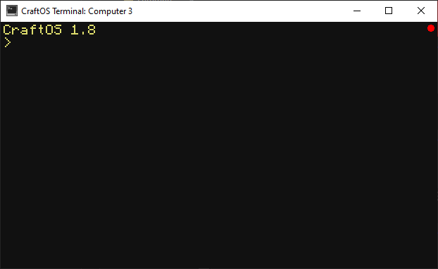

# Screenshots & Recording
CraftOS-PC includes built-in screenshot and GIF recording support. This allows you to take screenshots and videos of the CraftOS terminal at any time, which can be useful when demonstrating a program. It also doesn't require any external tools such as Snipping Tool or `recgif`.

## Taking screenshots
A screenshot can be captured by pressing the F2 button. The resulting image will be saved in `screenshots` in the CraftOS-PC save directory, with a file name with the time and date. The image is saved in PNG format, ready to be viewed on the Internet or edited in a photo editor. Pressing F12 will also take a screenshot, but the image will be available on the clipboard rather than being saved to disk (Windows & Mac only).  

`term.screenshot()` can also be used to take a screenshot.

## Recording videos
Recordings can be taken by pressing the F3 key. A red circle will appear in the corner of the window, indicating the screen is being recorded:

To stop recording, press F3 again and the recording will be saved in `screenshots` in the CraftOS-PC save directory, with a file name with the time and date. The recording is saved as a GIF, which can easily be posted to a GIF-hosting website such as Imgur.

## WebP vs. PNG/GIF
CraftOS-PC v2.6.1 adds the ability to take screenshots and recordings in WebP format. WebP is an image format developed by Google that is designed to use much less data than other standard image formats, and it supports animation as well. Using WebP can reduce the size of screenshots and recordings by over 20x. The `useWebP` config setting controls whether WebP is used: if set to `true`, screenshots and recordings will be taken exclusively in WebP format. Otherwise, screenshots will be in PNG format, and recordings will be in GIF format.

By default, WebP is disabled. Even though all modern web browsers and operating systems support WebP, not all of them support animations, with Discord being a big concern. If you do enable WebP, keep in mind that compatibility is not as universal as PNG or GIF.

## Note about `ignoreHotkeys`
When the config option `ignoreHotkeys` is set to true, F2, F3, and F12 will no longer take screenshots or recordings. Use `term.screenshot()` to take a screenshot instead.